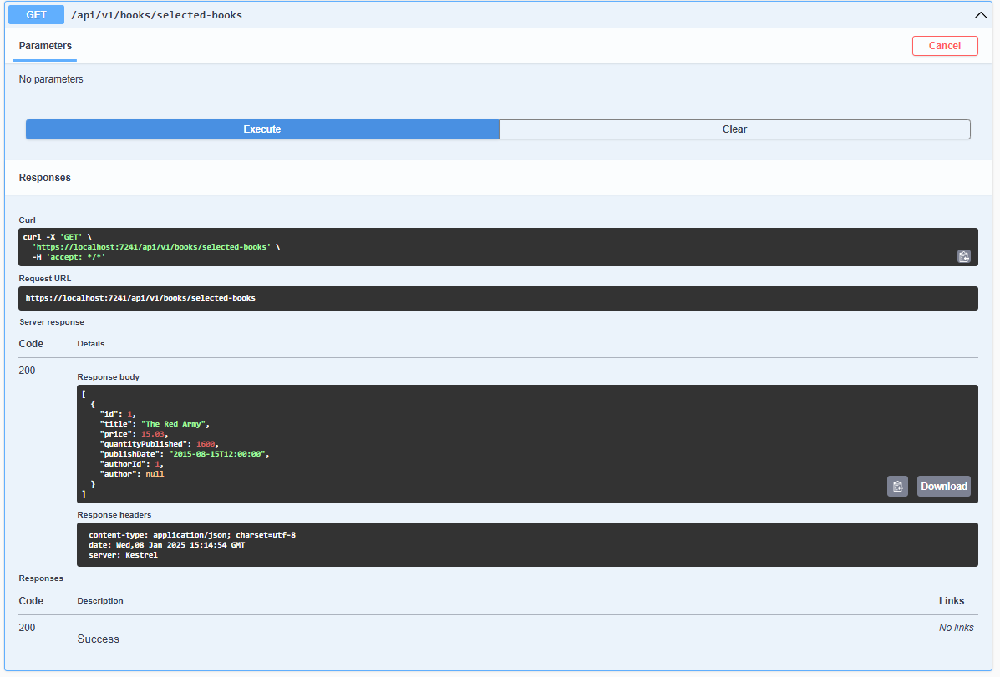
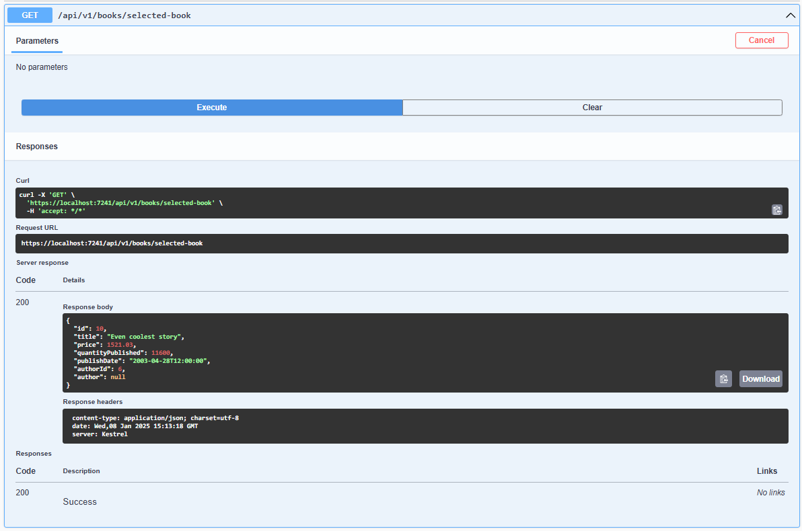
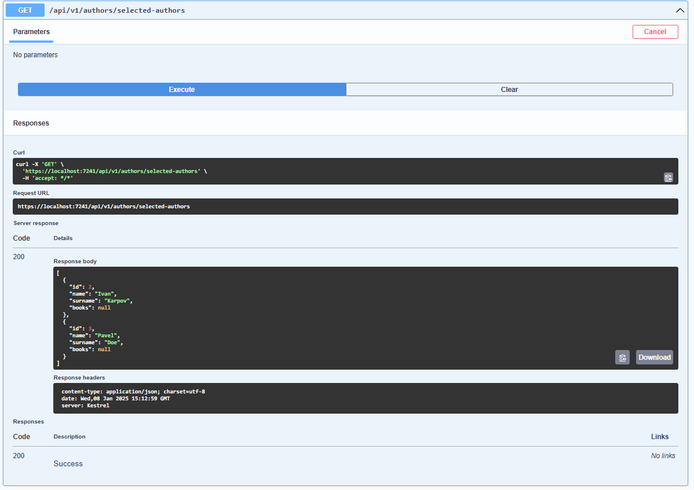
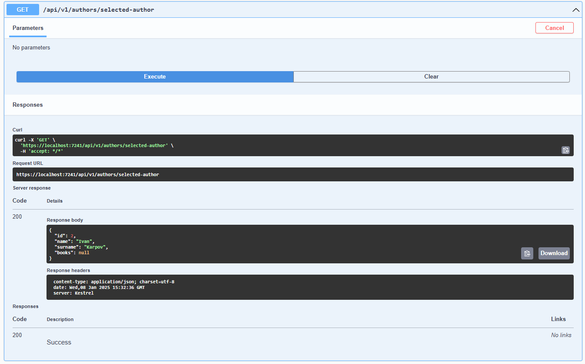

# Выпонение тестового задания
В запросах я испольовал .AsNoTracking() поскольку данные извлекаются только для чтения и не изменяются. Это позволяет улучшить производительность.

В модели Author и Book имеют двустороннюю связь
Поэтому:
1. BookService возвращает книги у которых Author = null
2. AuthorService возвращает авторов у которых Books = null  

При получении книг я не использовал .Include(b=>b.Author)
При получении авторов я не использовал .Include(a=>a.Books) 

Поскольку в таком случае бы возникли циклические зависисмости и ошибки при выполнении запроса.
Если всё таки необходимо возвращает книги вместе с их автором и авторов вместе с их книгами, можно использовать DTO, либо указать [JsonIgnore] для одного из свойств, либо такой вариант:
```csharp
services.AddControllers()
        .AddJsonOptions(options =>
        {
            options.JsonSerializerOptions.ReferenceHandler = System.Text.Json.Serialization.ReferenceHandler.Preserve;
        }); 
```````
В Program.cs был настроен Dependency injection для AuthorService и BookService.

Я использовал AddScoped, этот метод обыяно используется для работы с базой данных, чтобы экземпляр сервисов создавался один раз для каждого http запроса.


Стоимость опубликованного тиража вычислялась как произведение Price на QuantityPublished

Дата выхода альбома "Carolus Rex" была определена как DateTime(2012, 5, 25)

Если бы можно было изменять контроллеры, то в них стоит добавить try catch,
а в сервисах добавить проверку ситуаций, если данные соответсвующие запросу не были найдены
можно делать throw new InvalidOperationException, тогда в контроллере вместо Ok(result) можно возвращать  например Results.NotFound() 


## Демонстрация работы

1. Получение книги, в названии которой содержится "Red" и которые опубликованы после выхода альбома "Carolus Rex" группы Sabaton

2.  Получение книги с наибольшей стоимостью опубликованного тиража

3.  Получение авторов, написавших четное количество книг, изданных после 2015 года

4.  Получение автора, который написал книгу с самым длинным названием ( в случае если таких авторов окажется несколько, необходимо вернуть автора с наименьшим Id)

